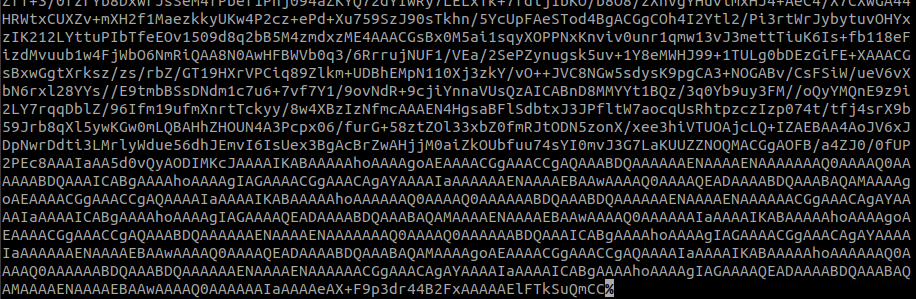
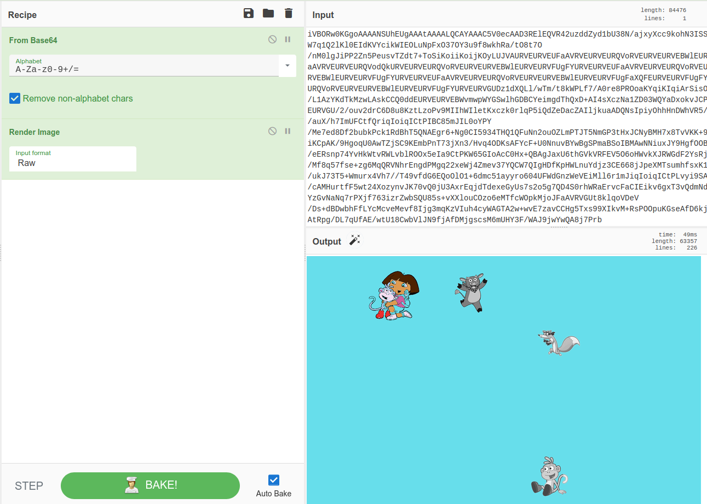
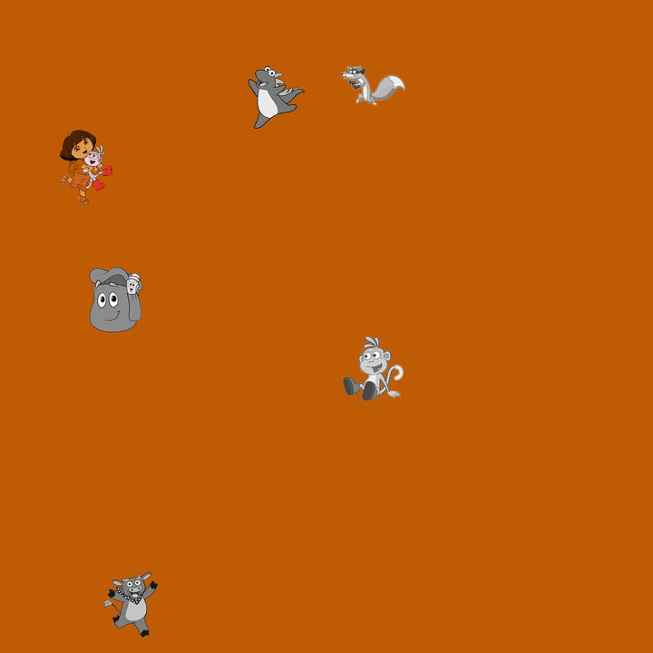
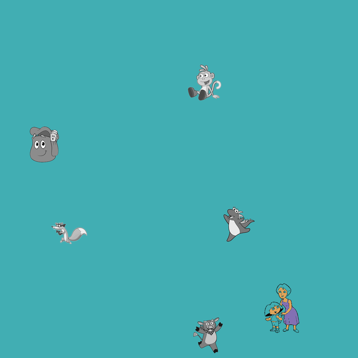
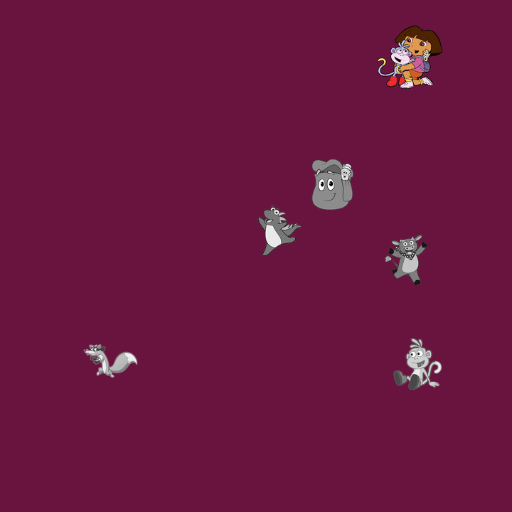

# Dora

Dora was part of the [nullcon HackIM CTF](). Two indications were given to us:
 - `nc misc.ctf.nullcon.net 8000`
 > Dora needs to be found 800 times

## Recon

By connecting to the server two lines were displayed.
 
The first one is `Where's Dora? 1 for upper right, 2 for upper left, 3 for lower left, 4 for lower right`
 
A very large string was following.



Using CyberChef we can see it is just an embedded PNG image. There is a uniform background with sprites stuck on it.



The idea is thus to find in which sub image Dora has been placed, in a PNG image cut in four. We need to do that 800 times.

We can start by collecting several images from the server and have a look at them.

<p float="left">
  
   
  
</p>

Image processing techniques will be very useful to solve this challenge.
After some research, a well-known library called OpenCV has been implemented in Python. 

Moreover, we can notice several facts.

Fact | Consequence
-----|------------
Five sprites out of six look always the same. | They can be identified.
Dora changes everytime. | It could be difficult to identify Dora if there are a lot of different sprites of her.
The background colour changes everytime. | We should get rid of colours and focus on shapes.

## Methodology

The main idea is to gather the five sprites that are always displayed, and use them to identify those in all images received by the server. Then remove them, and find the remaining sprite which is Dora.

Note that another possible way to solve the challenge whould have been to collect all images of Dora and use them to detect her. I got 10 different sprites, so in average it would take the same time as looping everytime over 5 templates (the not-Dora's ones).

The sprites gathered should look the same as those in all received images. Thus, the following steps need to be applied on both the collected sprites and the image.

1. Preprocessing: prepare an image so it is easier to perform other image processing techniques on it. In our case:
    - Transform the RGB sprite/image in Gray
    - Enlarge the borders (only on the image) to be sure all templates will always fit in received images. It could be an issue for detection if a sprite has been placed to close to a border, knowing that our templates will also have borders.
    - Highlight shapes and remove the background, so partitioning the image will be easier.
2. Segmentation: create two partitions, one for the sprites and one for the background. 
3. Detection: match two images, in our case a template an the image received from athe server.
4. Postprocessing: get the information we are looking for

**Templates**
---

It is easy to extract sprites from an image using [Spritex](https://github.com/codetorex/spritex). Here is the result:


In order to create our templates we need to apply the same Preprocessing and Segmentation steps as for the main image. Here is a script which needs to be executed only one time.

```python
from imutils.paths import list_images
import imutils
import cv2

# Here are located the sprites cropped with Spritex
path_sprites = 'sprites'
# This directory will contains the templates
path_segmented = 'seg_sprites'

i = 1

# We go through all sprites and analyze them
for spritePath in list_images(path_sprites):

	# Loading the collected sprite
	image = cv2.imread(spritePath)

	# Transforming the image from BGR to Gray
	image = cv2.cvtColor(image, cv2.COLOR_BGR2GRAY)

	# Calculate the (Sobel) gradient of the script, which emphasize the shapes
	image = cv2.Sobel(image,cv2.CV_8U,1,0,ksize=5)

	# Segmentation (= partitioning)
	ret,thresh = cv2.threshold(image,127,255,cv2.THRESH_BINARY)

	# Storing the template
	image_dest = path_segmented + '/' + str(i) + '.png'
	cv2.imwrite(image_dest, thresh)

	i = i + 1
```

**Main image**
---

For the preprocessing step, the image is also enlarged to avoid borders effects (like if a sprite appears to be stuck to a border).

The segmentation step stays the same.

The script will try to find all of the sprites matching our templates in the image. It will then remove those occurrences in a copy `imerased` of the original image. The resulting image will only contains white pixels (don't forget, the image is segmented) of our beloved Dora.

Finally, the script counts all white pixels (so belonging to Dora) in the image and checks in which part of it there are the most.

Here is a self-explained code.

```python
from imutils.paths import list_images
import numpy as np
import pickle
import imutils
import cv2
from pwn import *
import base64

#Variables
path_seg_sprites = 'seg_sprites'
image_path = 'im_dl.png'

# Remote connection
context.update(log_level='info')
conn = remote("misc.ctf.nullcon.net", 8000)

# Get the first line from the server
conn.recvline()

# We need 800 images to get the flag
for i in range(800):

	# Get the image from the server and store it in a file
	file = conn.recvuntil(b'\n\n', timeout=60)
	f = open(image_path, "wb")
	file = file[:-2]
	file = file.decode('utf-8')
	f.write(base64.b64decode(file))

	# Load the image
	image = cv2.imread(image_path)

	# Preprocessing
	image = cv2.cvtColor(image, cv2.COLOR_BGR2GRAY)
	image = cv2.copyMakeBorder(image, 15, 15, 15, 15,cv2.BORDER_CONSTANT, value=image[0,0].item())
	image = cv2.Sobel(image,cv2.CV_8U,1,0,ksize=5)

	# Segmentation
	ret,thresh = cv2.threshold(image,127,255,cv2.THRESH_BINARY)

	# We will erase all sprites but Dora on this copy
	imerased = thresh.copy()

	# We iterate over all sprites that we generated before and analyse their occurence
	for spritePath in list_images(path_seg_sprites):

		# We load the template
		template = cv2.imread(spritePath, cv2.COLOR_BGR2GRAY)

		# We look for an ocurrence of the sprite in the image
		res = cv2.matchTemplate(image,template,cv2.TM_CCOEFF)

		# We calculate the identified sprite's location on the original image to remove the pattern from imerased

		h = template.shape[0], w = template.shape[1]
		min_val, max_val, min_loc, max_loc = cv2.minMaxLoc(res)
		
		top_left = max_loc
		bottom_right = (top_left[0] + w, top_left[1] + h)
		bottom_left = (top_left[0], top_left[1] + h)
		top_right = (top_left[0] + w, top_left[1])

		# Removing the sprite
		imerased[top_left[1]:bottom_left[1], top_left[0]:top_right[0]] = 0

	# We divide the image in 4 and calculate the remaining number of pixels per sub image
	h = imerased.shape[0]
	w = imerased.shape[1]
	nb_pix = [0, 0, 0, 0]
	nb_pix[0] = np.sum(imerased[:h//2,:w//2] == 255)
	nb_pix[1] = np.sum(imerased[:h//2,w//2+1:] == 255)
	nb_pix[2] = np.sum(imerased[h//2+1:,:w//2] == 255)
	nb_pix[3] = np.sum(imerased[h//2+1:,w//2+1:] == 255)
	i_max = nb_pix.index(max(nb_pix))

	# Print the info in stdout
	if i_max == 0:
		print("["+str(i+1)+"] Top Left (2)")
		conn.sendline(b'2')
	elif i_max == 1:
		print("["+str(i+1)+"] Top Right (1)")
		conn.sendline(b'1')
	elif i_max == 2:
		print("["+str(i+1)+"] Bottom Left (3)")
		conn.sendline(b'3')
	elif i_max == 3:
		print("["+str(i+1)+"] Bottom Right (4)")
		conn.sendline(b'4')
	else:
		print("Error")


conn.interactive()
```

After having iterated 800 times, the server returns another image with the flag.


